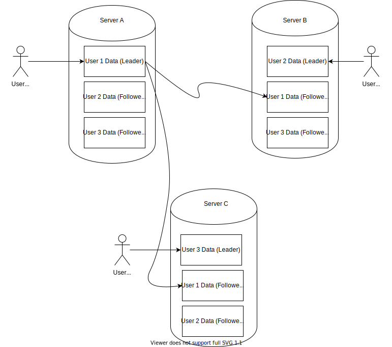
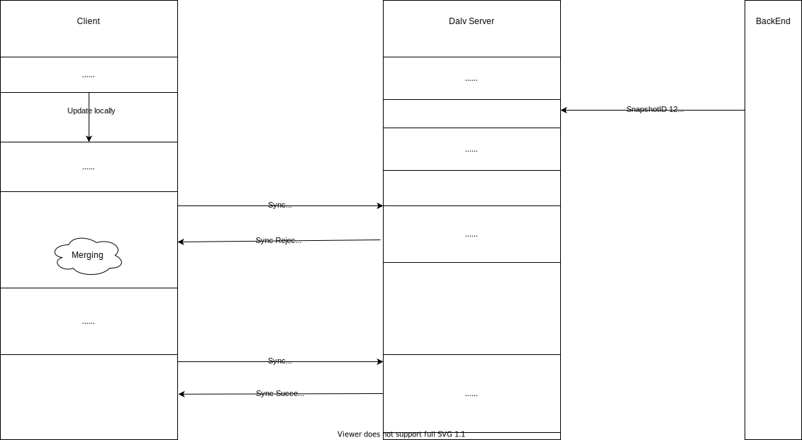

# Design
## Terminology and System overview
DalvDB system could be divided into two parts, clients and servers. Client is any software running on the end-user 
device, server is any instance of Dalv server. Backend application is the backend application running on the servers
other than Dalv nodes. Clients could connect to Dalv servers as they can connect to backend application.
Number of clients is equal or greater than the system users which their data stored in the DalvDB servers 
(greater because each user could use several devices). Clients could be online or offline, synced or out of sync,
and they are usually some application with underlying storage capability, like Mobile applications, Single Web Page applications, or desktop applications.

Servers managed by the service owner as a cluster of (virtual)machines, connected to each other over network. They could be 
laid on different data-centers. Each online client could contact the server which contains its user data (leader) by a
TCP call (gRPC).

Whole data, partitioned base on user and each user data stored in several servers to guarantee durability. For each 
partition there is just one leader, and a configurable number of followers (By default 2). Clients should establish their 
connections to the leader of their data.

In case of leader failure, cluster elects a new leader for each 
partition that its leader located on the crashed server. New leaders (Each server could be a leader for several partitions, so each of
these partitions could find a new leader on different servers) are the previous followers and after elections, client should contact with its
new leader. Each user data has just one leader and each server could be a leader of several users and a follower of several other users data.

It's important to note that if client connects to a wrong server, the server could tell it the address of its leader. 
so client could contact each server and if the server wasn't its leader, it could then figure it out by the response 
from the wrong server and contact its own leader on the second try. By this method, DalvDB mitigate this fact that there 
is no definite location of each partition leader, leaders could be relocated at any time.

## Data Format
User data are in key/value format. There are two types of key:
1) User Domain Key: Keys that user owned their values. 
2) System Domain Key: keys that system owned their values.

For user domain keys, which are owned by user, updates could be initiated by backend system or by modification made by user 
on his/her own copy(clients could update their copy) and passed by SYNC command to servers. 
For system domain keys, which are owned by system, updates could only be applied by backend system and clients only can get 
the new values by SYNC command.

## Consistency
As described in previous section, there are two types of keys, user domain keys could be updated on client devices even 
if the user is offline, however System domain keys could be just updated on server side, and the client just has a copy 
of that(read-only)

For system domain keys, as there is just one writable point for them (the leader), all writes are handled sequentially 
in the leader. Even if several backend-servers try to update a single data, leader do their updates sequentially by 
locking the user bucket.

For user domain keys, as they could be updated by both client and backend in parallel, a conflict resolution mechanism 
is necessary.

### Client side conflict resolver
During synchronization, client sends all updates along with a snapshot-Id (we call these updates, Operations), which 
indicates the last point of data that client synced previously. (we talk about snapshots and snapshot-Ids later)
The leader checks whether any keys that clients wants to update, changed after the snapshot point which client is aware 
of or not. If any key changed, server rejects the client updates and sends all operations happened after the client 
snapshot-id, it also provides a new snapshot-id in its response. Now this is client's responsibility to merge all the 
operations happened in the server to its own operations. After merging them, it can send a SYNC request again with new 
snapshot-id and operations (include merging operations). In this process client is able to discard all the backend updates, 
or discard its own updates, or marge them and produce new kinds of updates(operations). 
Note that, as data stored in log based format, if client decided to discard a server's operation, it should add a new 
operation which is its reverse operation. for example if client decided to discard an 'ADD_TO_LIST' operation, it should add a 
'REMOVE_FROM_LIST' operation.

In the example below, client decided to merge both updates.

in the another example below, client decided to override backend update. note that if several PUT operations exist in 
the log, the value of that key is equal to the value of the last PUT operation.

## Snapshot and SnapshotId
Dalv servers store the user data as an append-only list of log entries. Each operation transforms to a single log entry, 
however there is another type of log entry, 'snapshot'. Snapshots are the special points in the logs which clients could
refer to. Snapshot automatically added by the Dalv server after each Sync command. if Sync contains no operation and 
result is empty, Server doesn't generate any new snapshot.

## Commands
Clients and backend talk to Dalv servers via Commands. Each command except WATCH, entails a short-living TCP 
connection initiated by request initiator(client or backend) and may carry some information (usually operations).

### Sync Command (Client only)
Clients could manipulate the data (only user domain keys) offline. These manipulations contain several 'operations' entry.
Operation could be an assignment (PUT), deletion (DELETE), add a value to a key of type list ADD_TO_LIST, or remove a 
value from a key of type list REMOVE_FROM_LIST, reading data does not generate 'operation'.
At some point in time, client will decide to send their updates to the server and receive updates happened in the server. 
At this point, client should send a SYNC Request to server containing:
- the last snapshotId that client is aware of, and
- a list of all operations happened after last sync

The server may not accept the updates because it has detected some conflicts. If server is the leader, in any case 
(accept the updates or not) its response contains:
- the list of the operations since the last snapshotId provided by the client (it will entail the operations that client has 
sent by this SYNC command, if the request had been accepted)
- an indicator which indicates if the update from user accepted by the server or not.(OK or NOK)
- SnapshotId which indicates the point exactly after the updates carried by response(happened in the server but client 
does not aware of or updates that client had sent via SYNC) if nothing happened since last sync it will be the last 
snapshotId client provided.

If server rejects client's updates, it is the client's responsibility to merge received updates by its own and
send another SYNC command with new snapshotId provided in the first try.
An important feature of SYNC command is that it's Atomic, all or nothing. There is no chance some updates applied 
and some of them not.

### Update Command (Backend only)
As Backend is assumed always online(in contrast of clients), we'd expect Dalv servers be informed about all manipulations
applied on user data by the backend immediately, meaning backend-servers should send Update commands to the Dalv server
for each update, although, backend-servers may want to write in several keys in an Atomic way whereby they can send 
a list of operations by one Update command. Update request consists of:
- list of operations
and its response has an indication of whether the updates applied successfully or not.

### Get command (Backend only)
[TODO]

### Watch
WATCH is a mechanism for backend-server and clients to receive notification once some particular keys get updated. 
For this purpose, they should establish a long-running TCP connection to the leader and send a list of keys they are interested in.
Backend could subscribe keys for all users, for example they can request, please notify me if any user updates its 
theme color stored under the "theme.color" key. Clients could only subscribe to their own data. For example a 
client may request, please notify me if my timeline list, which is stored under "timeline" key, get updated.

### Propagate Updates (Dalv-to=Dalv)
Dalv servers do not respond back to the requester of SYNC or UPDATE commands until it makes sure the updates get
stored on the majority of the replicas(leader itself and followers). Thus, for each SYNC or UPDATE commands, the leader 
assigns a chronological TransactionId and sends all updates stamped by this TransactionId to the followers. Leader sends 
the response as soon as it receives the acknowledgment from the majority of the replicas(including itself).
For example if there are 2 followers and one leader, the leader will send the response to the requester as soon as it gets 
the first propagation acknowledgment. We will talk more about this mechanism in 'Servers coordination - Updates propagation' section. 

## Partitioning
Dalv partitions data based on User, each user data is a separated partition. Thus, for each user there is a partition on
the Dalv servers. Usually the number of partitions are far more than servers in the cluster, so each server should act as
leader for several partitions, it may also be a follower for several other partitions.
Followers and the leader of a partition, form a mini-cluster and each server could be a part of several mini-clusters.
The partitioning mechanism used in Dalv is consistent-hashing and each server on start-up chooses several hashes on the ring
and puts its hashes on the zookeeper, so each partition has a hash produced based on the UserId. If we move clockwise on the 
ring, from the hash of the partition, next 3(or more based on the replication configuration) hashes indicate the 
mini-cluster of the partition, the first one would be the leader.

## Servers coordination
Server nodes use Zookeeper to maintain their coordination. Servers could talk to each 
other in order to re-balancing(on the case of joining/removing nodes) and propagating updates from leaders to followers. 

### Updates Propagation
[TODO]
#### Filling the Holes
[TODO]
### Failure handling and Leader Election
[TODO]
### Re-balancing
[TODO]
